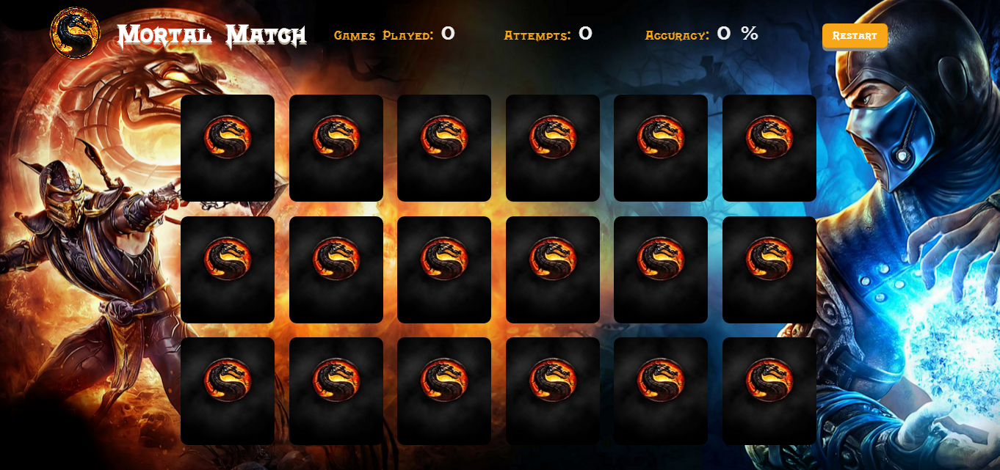
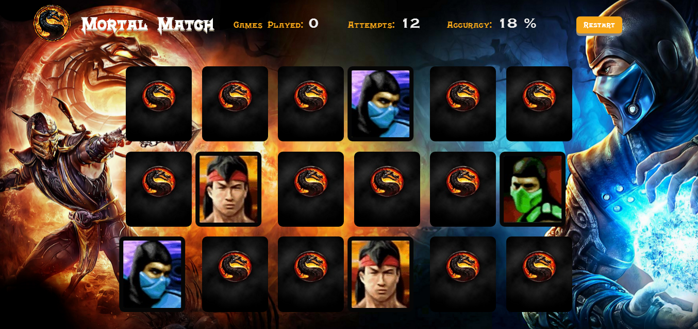

# Mortal Match

**About the Project**

Mortal Match is a game with 18 cards face down and the player has to try and match all 9 pairs of matching cards by remembering the position of the cards. Once the player has match 2 cards they will be displayed face up until all pairs have been matched. Once all pairs have been matched the user will be displayed a message that they have won the game. As the user clicks through the cards stats will be kept letting the user know how many attempts and the accuracy of their choices.

**Technologies Used**

* HTML
* CSS - Responsive Design (Flexbox)
* JavaScript / jQuery - DOM creation/Manipulation

**What I learned**

In this project I was able to grow my understanding of JavaScript/jQuery, and see how these technologies can be used to create elements and interact with the DOM (document object model). I was also able to use Flexbox, which is a great tool for this type of layout.

**Feature to Implement**
* Sounds for unmatched cards
* Improve reset/game end functionality and animation
* Convert functionality to Object Oriented Programming

